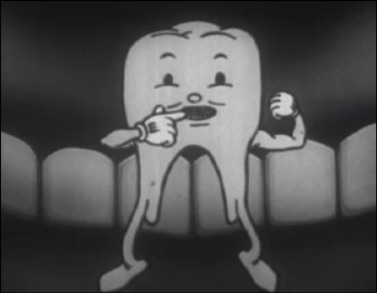
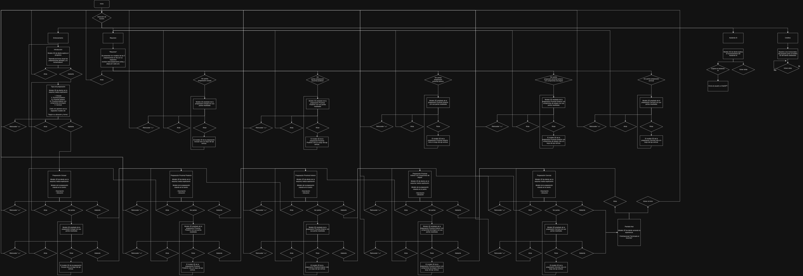

# OdontoAR

## Ejemplos previos
- Celular: https://e.webxr.run/?url=https%3A%2F%2F7epq7.zappar.io%2F5118301513931043946%2F
- PC: https://7epq7.zappar.io/8657460015101788198/v124.0/

## Diagrama de bloques

## Siguientes pasos
1. Activar el modo AR cuando el usuario entre al modo "Entrenamiento" y "Resumen"
2. Modelo 3D de mascota (muela o Tano) en Meshy.
3. Habilitar habla con la mascota haciendo uso de assets de Unity.
